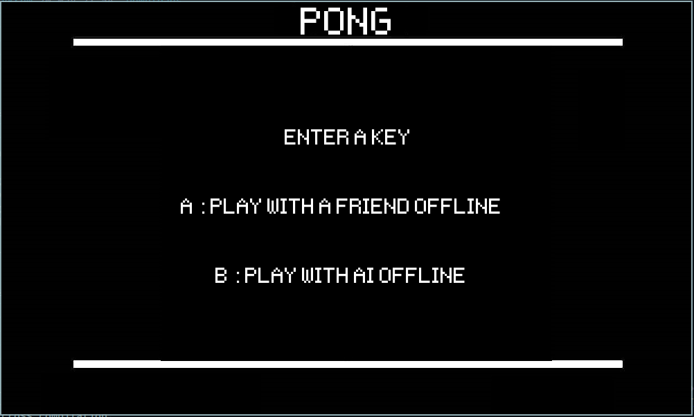
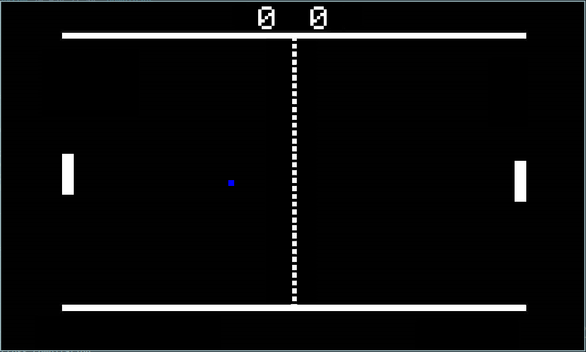
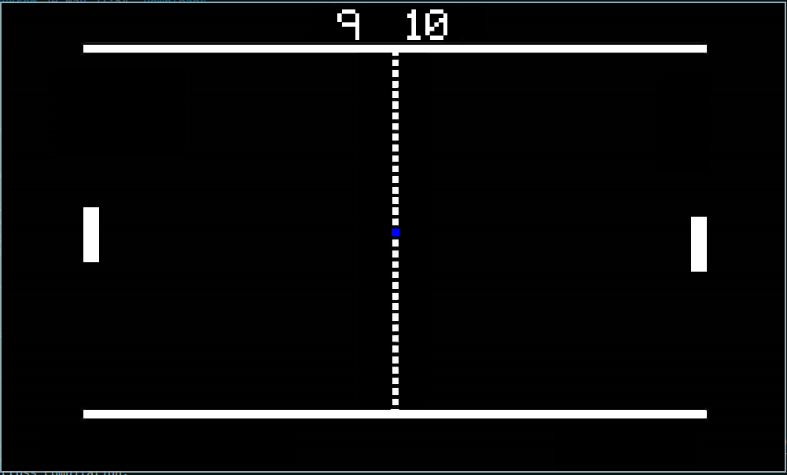

# PONG

A simple clone pong game implemented in Python using the Pygame library.

## Table of Contents

- [Description](#description)
- [Screenshots](#screenshots)
- [Installation](#installation)
- [Usage](#usage)
- [Whats New?](#whats-new)
- [Dependencies](#dependencies) 
- [Contributing](#contributing)
- [License](#license)

## Description

This project is a recreation of the popular pong game, developed using Python and the Pygame library.

## Screenshots

### After the game is launched

### During gameplay

### Game over

## Installation

- Clone this repo using the command `git clone https://github.com/tmpstpdwn/Pong` on you terminal or cmd
- open the folder `Pong` and just run `main.py` file. 
- thats it
- Enjoy

## usage 

- After running the `main.py` script; the game will be lauched with an interface asking you to click a key to start the game.
- HIT `A` to play with a friend offline or `B` to play with a simple "`AI`".
- For the left paddle you can use `w` and `s`.
- For the right paddle you can use `o` and `k`.
- NOTE: in the `AI` mode only right paddle can be controlled by the user using the keys specifed above.
- The game will go on until any of the 2 player scores 10 points.
- the objective of the game is to not let the ball go outside the court.

## Whats new?

- Nothing.

## Dependencies

- `python3` is required
- `pygame` is the only external package required to installed if not already installed
- Other packages used are part of the standard library such as
    - `random`
    - `os`

## Contributing

Contributions are welcome! Please fork the repository and submit a pull request with your changes. For major changes, please open an issue first to discuss what you would like to change.

## License

This project is licensed under the GNU General Public License v3.0. See the [LICENSE](LICENSE) file for details.
